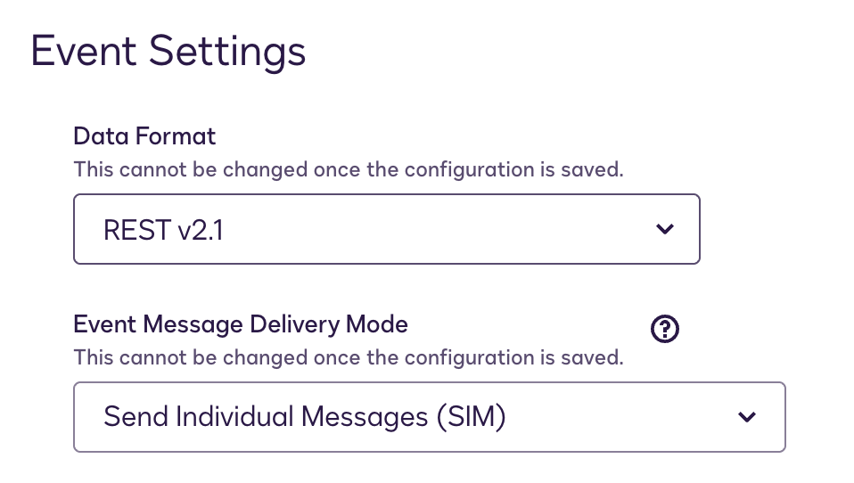

# Create Webhooks for Navigator Events

## Navigator Webhook Events

| Event                          | Trigger                                             |
|--------------------------------|-----------------------------------------------------|
| agreement-created              | a new agreement is created in Navigator             |
| agreement-extractions-reviewed | the number of pending extraction reviews is reduced |
| agreement-reviews-complete     | the number of pending extraction reviews reaches 0  |
| agreement-updated              | a user manually modifies an agreement in Navigator  |
| agreement-deleted              | an agreement is deleted in Navigator                |

## Creating Custom Configurations Using Navigator Events

These events are available only for custom Connect configurations created using the **JSON SIM** event model message format.

To create a JSON SIM configuration, use the default values for **data format** (REST v2.1) and **event message delivery mode** (SIM) as shown in the following image:

