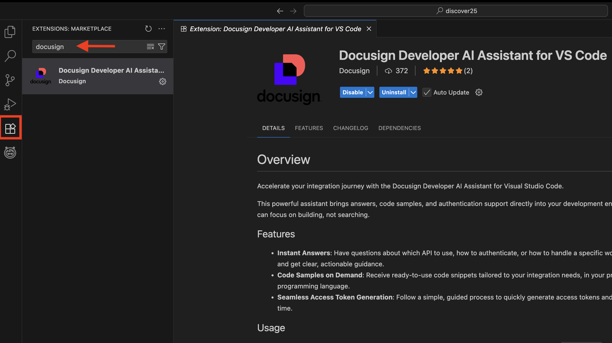
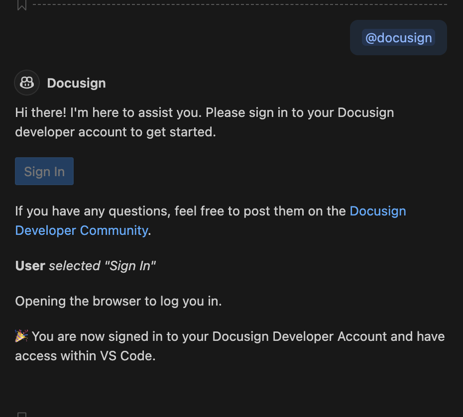
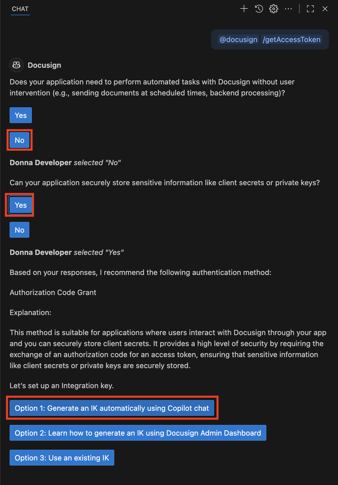
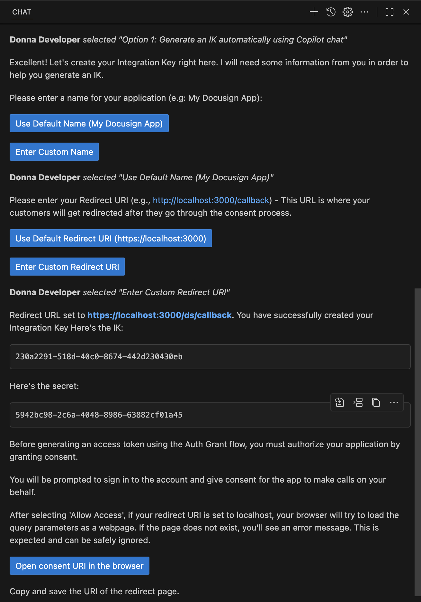
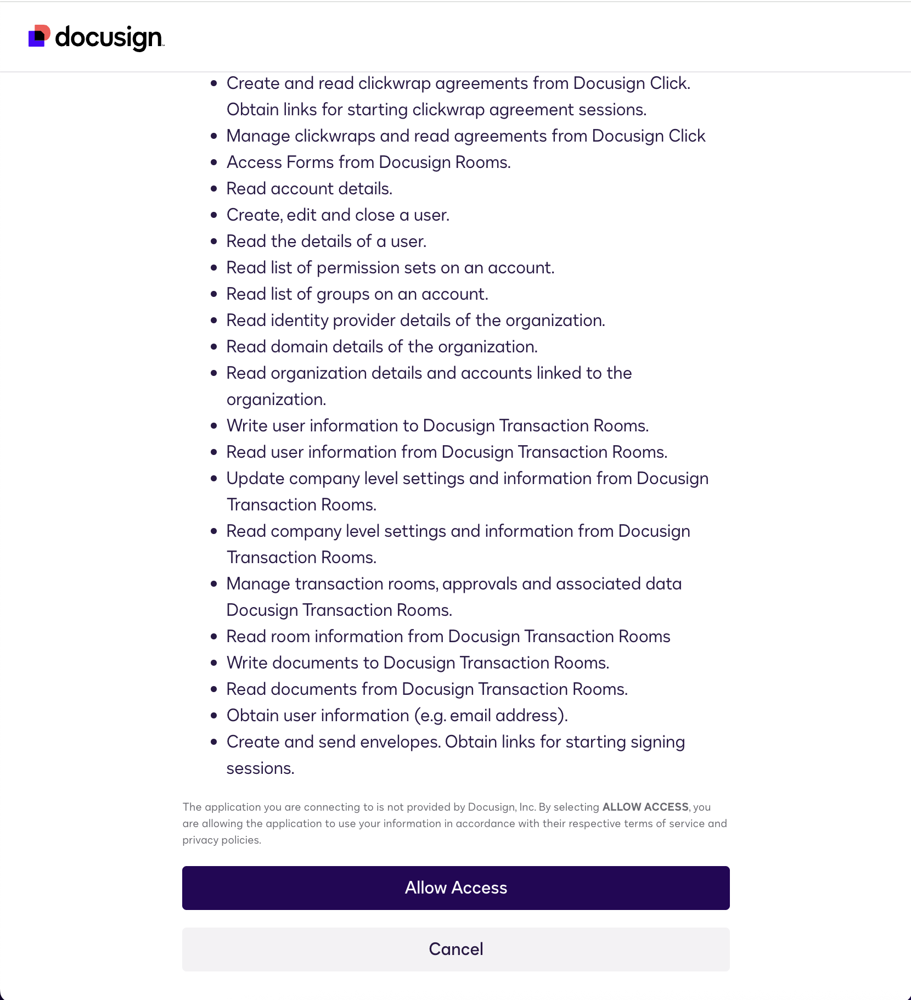
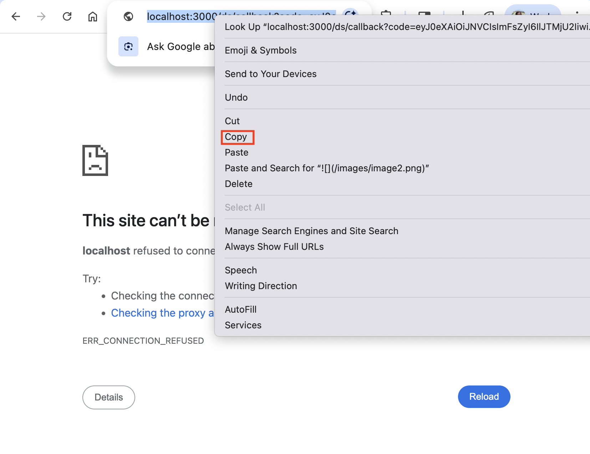
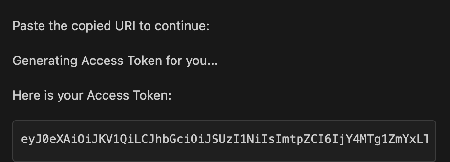
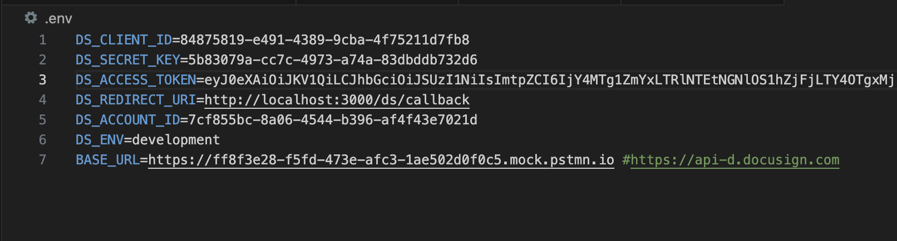

# Log into your Docusign account with Navigator access

Go to [apps-d.docusign.com](http://apps-d.docusign.com) and sign in with your developer account with Navigator access.  
Go to the Agreements tab and click completed to confirm that you have access. You should see a tag that says AI assisted.

# Obtain an access token Using the Docusign Developer AI Assistant for VS Code

1. [Set up GitHub Copilot in VS Code](https://code.visualstudio.com/docs/copilot/setup)  
2. Install the Docusign Developer AI Assistance for VS Code extension in VS Code extensions marketplace:  
   
3. Open GitHub Copilot by clicking on the Copilot icon in the Activity Bar or using the shortcut (Ctrl+Alt+P or Cmd+Alt+P on macOS).  
4. Add the AI assistant as a participant in the chat using the command @docusign and sign in with your Docusign developer account (with Navigator access).  
     
5. Copy the example.env file from the root of the project directory and save it to a new file named .env. This is where you will save your authentication information from the following steps.  
6. Enter  @docusign /getAccessToken and answer the follow the prompts to create and configure an integration key and generate an access token.  

   

7. Name your app and set the redirect URI to "https://localhost:3000/ds/callback".

   

8. Open the consent url and add the following scopes to the url:

```
%20adm_store_unified_repo_write%20document_uploader_write%20document_uploader_read
```

9. Reload the updated url and grant consent to the listed scopes.

     

10. After granting consent, copy the redirect URI.

    

11. Paste the URI into VSCode.

    

    

   It should also display your user info, and an example curl request using the access token.  
12. Copy the generated integration key, integration secret, and access token to your .env file as values to the respective environment variables DS\_CLIENT\_ID, DS\_SECRET\_KEY, and DS\_ACCESS\_TOKEN. Copy the account id from the displayed user info to the env variable DS\_ACCOUNT\_ID.  
   
    

# See your new IK on the apps and keys page:

Visit [https://admindemo.docusign.com/authenticate?goTo=appsAndKeys](https://admindemo.docusign.com/authenticate?goTo=appsAndKeys) 
